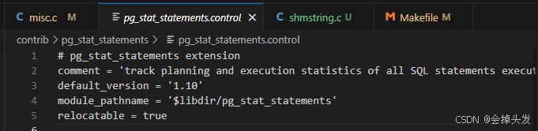
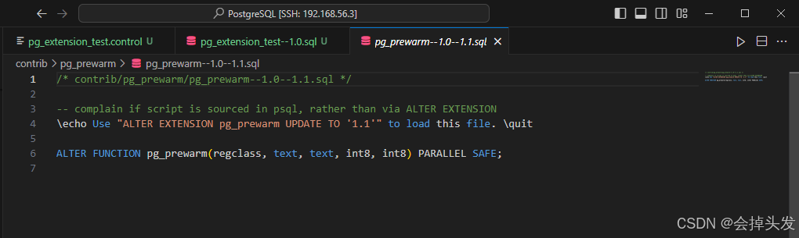
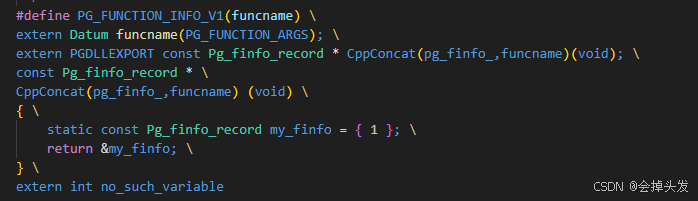
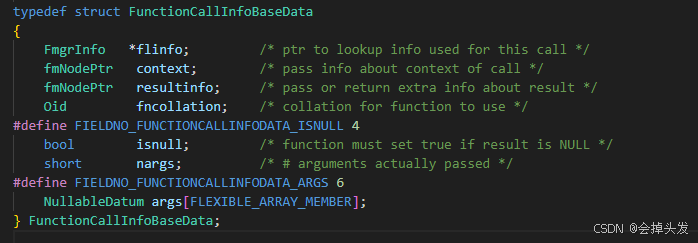
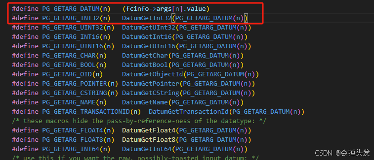
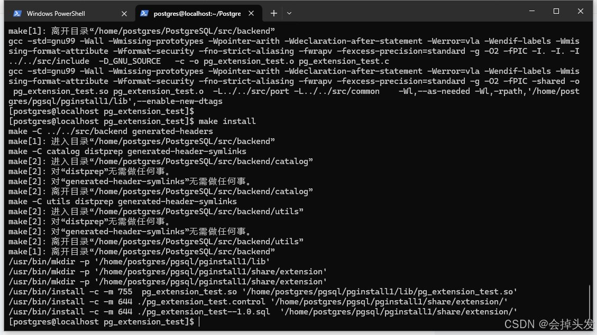
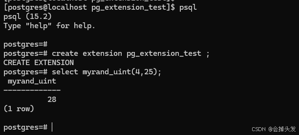
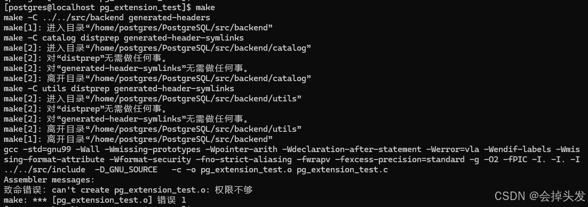

# postgres拓展函数

## 1、创建拓展文件夹，并创建其中的文件

首先在postgres的根目录下，有一个contrib文件夹，我们选择将拓展放在这个文件夹里面，首先创建一个文件夹，名字就是拓展的名字，叫做pg\_extension\_test，在其中创建四个文件如下：

- pg\_extension\_test.control
- pg\_extension\_test--1.0.sql
- pg\_extension\_test.c
- Makefile

### 1.1、编写pg\_extension\_test.control文件

pg\_extension\_test.control文件是用于控制拓展的文件，里面主要填写一些例如拓展的描述、拓展的版本、拓展的位置等信息，例如pg\_stat\_statements拓展里面就有这些信息：



其中第一行是这个拓展的名字，comment字段是指这个拓展的描述，default\_version是指拓展的使用版本，module\_pathname是指拓展文件夹存放的位置，relocatable表示这个拓展是否可以重定位。在这里，它的值是 true，意味着这个拓展可以被移动到不同的目录下，并且仍然可以正常工作。所以我们这里就可以编写自己的pg\_extension\_test.control文件：

```c
# pg_extension_test extension 
comment = 'Random Number Generate'
default_version = '1.0'
module_pathname = '$libdir/pg_extension_test'
relocatable = true
```

### 1.2、编写拓展需要创建的函数

即编写pg\_extension\_test--1.0.sql文件，该文件中使用的是sql创建函数的语法，表示该插件被创建的时候需要创建的函数。



可以看到pg\_prewarm拓展的sql文件中编写的内容，第一行表示如果想使用1.1版本的拓展，则使用这个命令进行更新，然后下面就是实现这个函数的语句，用于修改一个已经存在的函数属性。

接下来编写pg\_extension\_test--1.0.sql，这里直接创建一个新的函数myrand\_uint，接受两个integer参数，返回一个integer类型数据，AS 'MODULE\_PATHNAME', 'myrand\_uint' 是这个函数的部分实现，其中'MODULE\_PATHNAME'是一个占位符，会被替换为创建函数时指定的模块路径名，也就是前面我们在control文件中指定的PATH，然后 'myrand\_uint'是指这个函数在c语言中的名称，再然后LANGUAGE C表示函数的实现是使用C语言实现的，STRICT是指该函数如果遇到任何参数为空则不执行直接返回空。具体如下：

```sql
\echo Use "CREATE EXTENSION pg_extension_test" to load this file
 
CREATE FUNCTION myrand_uint(integer, integer)
RETURNS integer
AS 'MODULE_PATHNAME', 'myrand_uint'
LANGUAGE C STRICT;
```

### 1.3、 编写pg\_extension\_test.c文件

在上一小节我们指定了函数的实现是使用c语言实现的，函数的名称是myrand\_uint，接下来就用c语言实现该文件。

```c
#include "postgres.h"
#include "fmgr.h"
 
PG_MODULE_MAGIC;
 
PG_FUNCTION_INFO_V1(myrand_uint);
Datum myrand_uint(PG_FUNCTION_ARGS){
    int min = PG_GETARG_UINT32(0);
    int max = PG_GETARG_UINT32(1);
    if(min >= max)
    {
        ereport(ERROR,
            (errcode(ERRCODE_INVALID_PARAMETER_VALUE),
                 errmsg("min >= max")));
    }
    PG_RETURN_INT32(rand() % max + min);
}
```

其中两个头文件，postgres包含了核心数据类型和宏定义，fmgr提供了用于创建外部函数的框架。然后是PG\_MODULE\_MAGIC是一个宏，它必须出现在每个PostgresSQL的动态可加载模块中，用于验证模块是否是postgres兼容的。PG\_FUNCTION\_INFO\_V1(myrand\_uint);是一个宏，它会包括一些函数的声明之类的信息，详细内容可以看下图：



&#x20;详细观察函数的实现，其中Datum是函数的返回值类型，这里Datum是Postgres中用于函数返回值的通用类，其中PG\_FUNCTION\_ARGS也是一个宏，通过转到生命发现他是FunctionCallInfo对象，而这个对象是FunctionCallInfoBaseData的别名，找到这个结构体，具体如下：



在其中比较好理解的是后面三个，isnull是指函数的返回是否是空，如果是空，则需指定isnull等于true，nargs是指num of args，也就是函数参数的个数，而args数组则是存储函数的参数。这一点，我们在函数中写的类似int min = PG\_GETARG\_UINT32(0);可以看出来，转到PG\_GETARG\_UINT32的宏定义，可以发现其实他也就是在获取args数组里面的值，只是多了一些转换的步骤。



&#x20;然后就是函数中比较重要的部分，主体中使用ereport函数，也就是日志的打印，首先这个函数的第一个参数，ERROR表示这个日志的类型是报错，这个参数也可以设置为类似WARNING，表示日志类型是警告，然后第二个参数设置了错误码和错误信息，这个常用于postgres中处理一些错误信息，增强程序的健壮性。然后就是函数的返回，PG\_RETURN\_INT32类型，表示返回的值是int32类型的Datum类型。

### 1.4、编写Makefile文件

接下来就是编写Makefile文件，文件中的具体内容是：

```makefile
MODULE_big = pg_extension_test
OBJS = pg_extension_test.o 
PGFILEDESC = "Random Number Generator"
 
EXTENSION = pg_extension_test
DATA = pg_extension_test--1.0.sql
 
ifdef USE_PGXS
PG_CONFIG = pg_config
PGXS := $(shell $(PG_CONFIG) --pgxs)
include $(PGXS)
else
subdir = contrib/pg_extension_test
top_builddir = ../..
include $(top_builddir)/src/Makefile.global
include $(top_srcdir)/contrib/contrib-global.mk
endif
```

其中MODULE\_big用于指定构建的拓展名字，OBJS指定要编译的目标文件列表，其中DATA是指定的拓展的数据文件，通常是sql脚本，用于在安装拓展时执行数据库操作，然后下面的内容就是配置构建过程。

> 存疑，暂时先这么写，后面有更多了解之后再添加。

## 2、编译运行

首先进入到拓展的根目录下面，也就是contrib/pg\_extension\_test下面，执行如下操作：

```bash
make #编译
 
make install #安装
```



## 3、验证拓展是否实现

使用psql命令登录数据库，然后创建拓展create extension pg\_extension\_test；

执行函数myrand\_uint(4,25);

结果如下：



执行的结果可能不一样，大家不用在意结果是否都为28.&#x20;

## 4、错误

问题描述：因为我这里是使用vscode创建的文件，进行的编辑，而vscode使用的root远程登陆的服务器，所以这里使用vscode创建的文件就直接算是root身份创建的，而我使用的的shell工具登录的是postgres用户，这就涉及到了权限不足的问题。

解决办法：解决的办法就是重新赋予权限，使用root用户执行chown命令改变文件权限即可。

```bash
 chown -R postgres:postgres ./pg_extension_test
```


