# postgres系统表

## 写在前面

在使用postgres的时候，有很多表是我们一开始安装好数据库就存在的，这些表称为系统表，他们记载一些数据库信息，比如我们做运维工作常用的pg\_stat\_activity;我们在数据库中查询这张表可以发现他存储了一些数据库连接信息。如下所示：


本次的任务就是新增一张系统表pg\_test，这张表有三个字段，oid、id、ipaddr，字段所属的类型分别为Oid、int32、text，并且初始化一些值，实现能够在psql命令中使用select 命令查询得到。

## 1、创建系统表的声明

### 1.1、pg\_extension系统表的理解&#xA;

比如说我们查询pg\_extension这张表，我们可以发现它具有这些信息

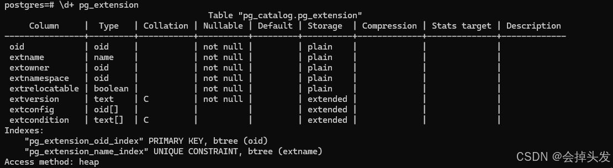

首先就是它具有一些字段属性，然后就是你会发现他还有index索引，有主键索引，有唯一性索引，然后我们在源码中搜索pg\_extension找到这张系统表的声明，观察这张表的实现，对其进行模仿写出我们自己的pg\_test系统表。

```c
#ifndef PG_EXTENSION_H

#define PG_EXTENSION_H

#include "catalog/genbki.h"

#include "catalog/pg_extension_d.h"

CATALOG(pg_extension,3079,ExtensionRelationId)

{

  Oid      oid;      /* oid */

  NameData  extname;    /* extension name */

  Oid      extowner BKI_LOOKUP(pg_authid); /* extension owner */

  Oid      extnamespace BKI_LOOKUP(pg_namespace);  /* namespace of
    - contained objects */

  bool    extrelocatable; /* if true, allow ALTER EXTENSION SET SCHEMA */

#ifdef CATALOG_VARLEN      /* variable-length fields start here */

  /* extversion may never be null, but the others can be. */

  text    extversion BKI_FORCE_NOT_NULL;  /* extension version name */

  Oid      extconfig[1] BKI_LOOKUP(pg_class);  /* dumpable configuration
    - tables */

  text    extcondition[1];  /* WHERE clauses for config tables */

#endif

} FormData_pg_extension;

typedef FormData_pg_extension *Form_pg_extension;

DECLARE_TOAST(pg_extension, 4147, 4148);

DECLARE_UNIQUE_INDEX_PKEY(pg_extension_oid_index, 3080, ExtensionOidIndexId, on pg_extension using btree(oid oid_ops));

DECLARE_UNIQUE_INDEX(pg_extension_name_index, 3081, ExtensionNameIndexId, on pg_extension using btree(extname name_ops));

#endif              /* PG_EXTENSION_H */

  //去掉注释的结果如上所示。
#
```

首先它写了预处理指令，防止该头文件被重复定义，然后他引用了两个头文件，其中genbki头文件它包含了一些宏定义，我们可以打开很多系统表的定义，可以发现都包含了这个头文件，另外一个是pg\_extension\_d头文件，他比较特殊，我们打开这个头文件可以发现有如下信息：

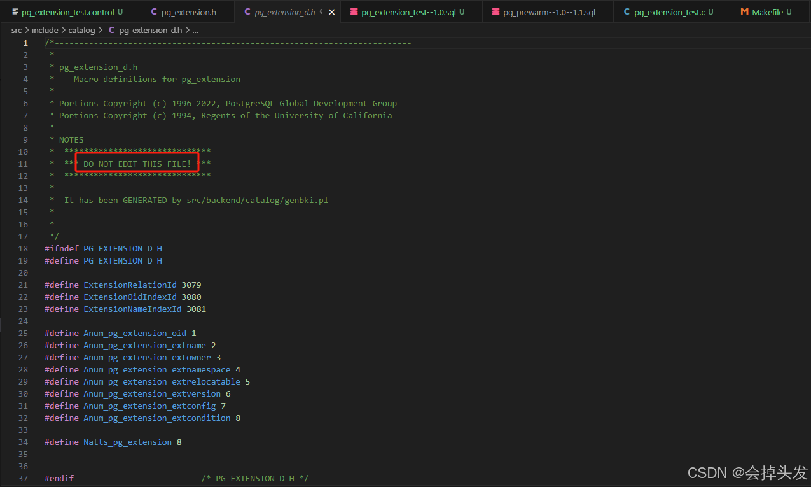

其中比较显眼的我们可以看到用英文写着不要编辑这个文件，也就是说明这个文件是自动生成的，再观察其他部分，发现这个文件里面有很多的宏定义，对照前面的pg\_extension头文件里面的信息一起观察，可以发现

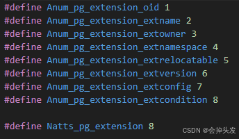

上图所示前八个分别对应了pg\_extension系统表的八个属性，然后最后一个宏定义则是表示具有八个属性列，这一点在我们后面对系统表进行操作的时候会常用到，然后还有如下几个宏：

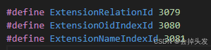

其中第一个是指系统表的唯一标识的id值，这一点在前面的博客中已经提到过了，如何获取未被使用的id值，后面两个是索引的id值。

### 1.2、创建自己的系统表

所以我们就明确了系统表的创建方法：

- 预处理语句
- 引用头文件 catalog/genbki.h和自动生成的头文件"catalog/pg\_extension\_d.h
- 对表的属性进行定义
- 创建表的索引

所以我们在include/catalog下面创建我们自己的pg\_test头文件，编写如下：

```c
#ifndef PG_TEST_H
#define PG_TEST_H
#include "catalog/genbki.h" // 该文件中定义了 CATALOG, BKI_BOOTSTRAP 等相关的宏。
#include "catalog/pg_test_d.h"

CATALOG(pg_test,3813,TestRelationId)
{
  Oid oid;
  int32 id2;
  text ipaddr;
}FormData_pg_test;

typedef FormData_pg_test *Form_pg_test;
DECLARE_UNIQUE_INDEX_PKEY(pg_test_relid_seqno_index, 1382, TestRelidSeqnoIndexId, on pg_test using btree(oid oid_ops));
DECLARE_INDEX(pg_test_relid_id2_index,388,TestRelidid2IndexId,on pg_test using btree(id2 int4_ops));
DECLARE_INDEX(pg_test_relid_ipaddr_index,389,TestRelidipaddrIndexId,on pg_test using btree(ipaddr text_ops));

#endif

```

在这其中CATALOG的方式创建可能与我们之前学习的创建一个结构体的方法不同，但是其实他也是创建了一个结构体，转到CATALOG的定义处可以发现其实也是创建了一个结构体。

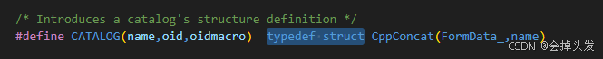

然后值得一说的是它对应三个参数，name即系统表的名字，oid即系统表的唯一标识，oidmacro即系统表的唯一标识oid的宏定义名称。

然后就是系统表的参数，再然后就是系统表这个结构体的名称即FormData\_pg\_test这里使用的是同意的命名方法，可以参考pg\_extension头文件。

紧接着就是索引的创建，首先是创建一个什么样的索引，这里使用DECLARE\_UNIQUE\_INDEX\_PKEY方法创建一个唯一性的主键索引，使用DECLARE\_INDEX创建两个普通的btree索引，他们的参数分别是索引的名称，索引对应的唯一的id值，索引唯一的id值所对应的宏，然后就是创建一个什么类型的索引，并且指明创建的索引存在那一个列属性上面。

## 2、初始化系统表的数据

细心的朋友可以发现在这个文件夹里面不仅存在.h头文件，还存在一个.dat的文件，这里以pg\_tablespace.dat文件为例，点进去可以发现，里面分别对应该系统表的所有属性列，再在数据库中查询这张系统表，查询结果如下图，也就是说这里存储的就是系统表的初始值。

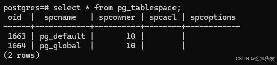

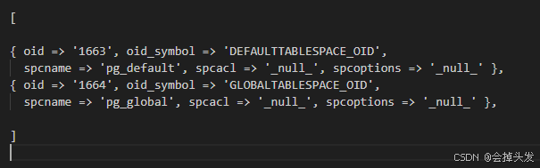

所以我们也创建一个pg\_test.dat文件，并且按照上面的格式对数据进行初始化，但是有一点需要格外注意，这里的oid也是不可以重复的值哦！也是需要查询未被使用id作为可以初始化的id。

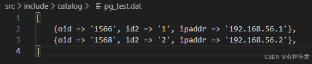

## 3、 编写Makefile文件加载新增的头文件

在catalog下面的Makefile中添加如下所示的内容：

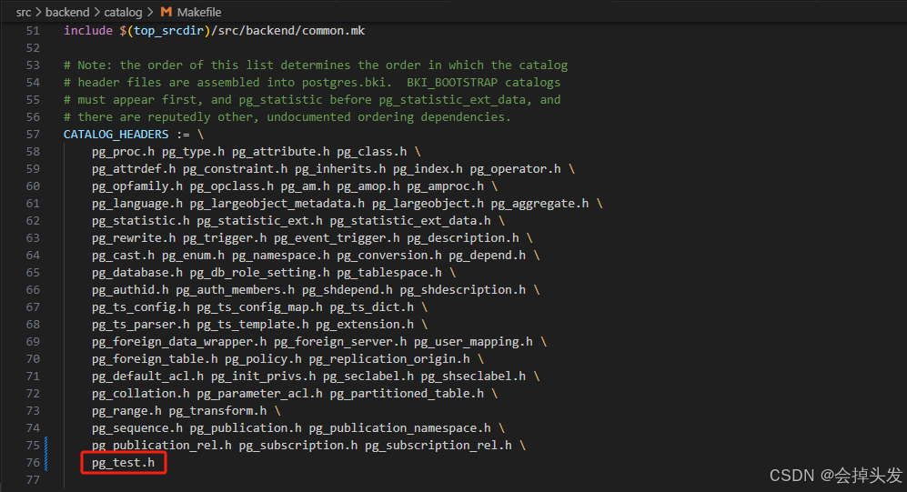

## 4、重新configure和编译安装

首先使用make maintainer-clean命令清楚之前执行的configure

然后使用configure命令重新安装，（具体命令可见之前的博客内容）

其次使用make -j6命令进行编译

然后使用make install命令进行安装

最后记得重新初始化一个数据库data才可以生效

## 5、结果验证

首先使用psql命令登录数据库，然后使用\d+命令查看pg\_test系统表的详细定义，最后使用select \* from pg\_test命令查询该系统表是否存在初始化的数据。验证结果图如下：

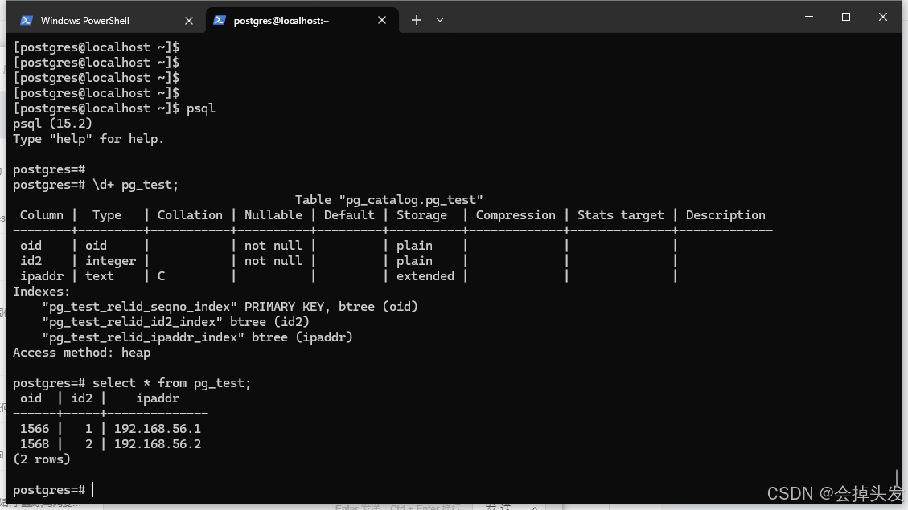

## 6、错误：

问题描述：开始这里存在波浪线提示引用错误，如图所示

解决方法：是因为这个文件是自动生成的，目前还没有进行编译，自然就还没有生成，所以会报错，忽略即可。

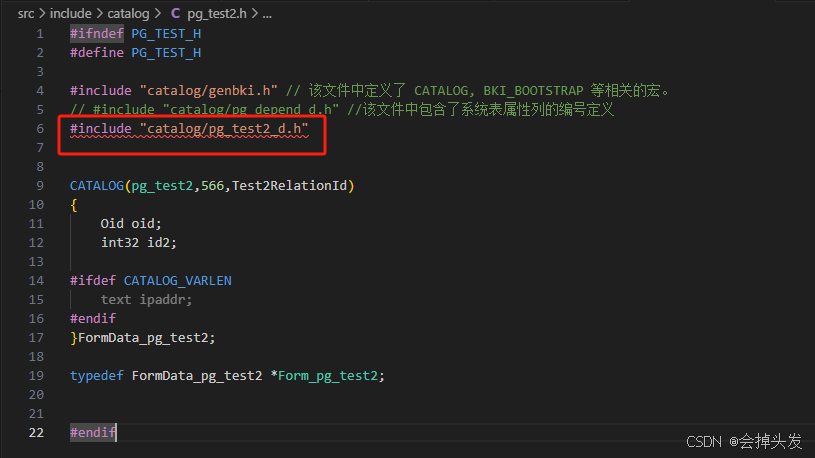

问题描述：在执行make命令的时候出现如下图所示报错

解决办法：报错出现的原因是因为所使用的oid值重复了，这里再使用unused\_oids命令查询未被使用的oid即可


